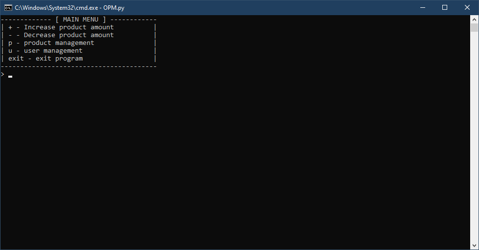
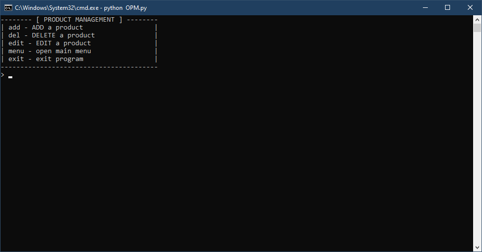
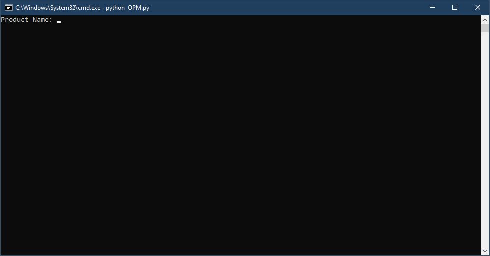
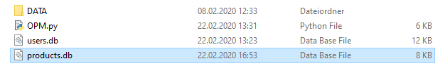
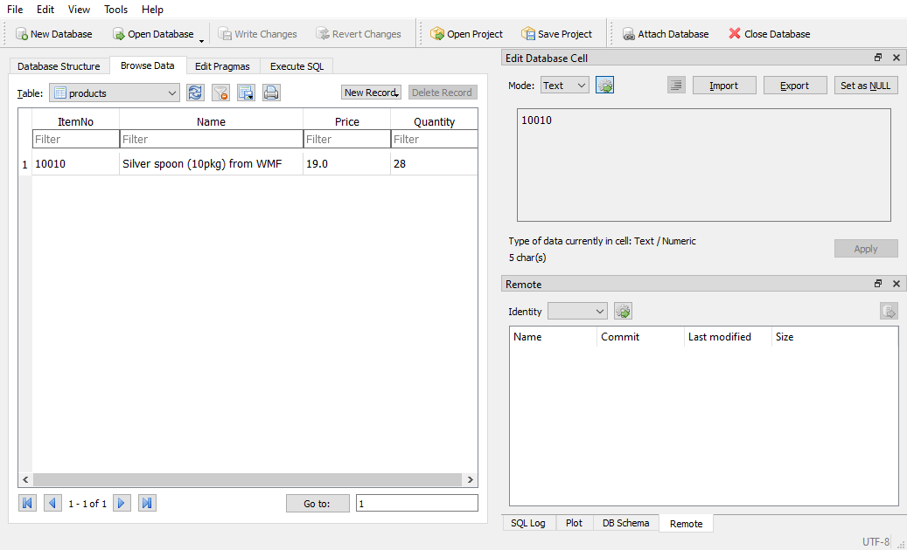

# Documentation
###### First Steps

# First Steps
Open OPM.py to run Open Product Manager.  
After OPM has opened, a login prompt appears. *(Image 1)*  

  
*Image 1: Login prompt opens*  

The user name must be entered here and can be confirmed with the Enter key.  
*By default the username is root*  
Now you are asked to enter a password.  
*By default the password is !root*

If the login was successful, you should now see the main menu. *(Image 2)*  

  
*Image 2: Main Menu opens*  

# Add a Product
In this example we have a product with the following properties:
* Name:
  * Silver spoon (10pkg) from WMF
* Itemnumber:
  * 10010
* Price:
  * $ 19
* Available quantity:
  * 28  
  
To add a new product, you must enter the product management.  
For this purpose the letter "p" (without quotation marks) must be entered in the main menu and confirmed with the Enter key.  
Now the product management menu should be open. *(Image 3)*  

  
*Image 3: Product Management Menu opens*  

to add a product, enter "add" (without quotation marks) and confirm with the Enter key.  
Now you are asked to enter the properties of the product.  

  
*Image 4: Enter product information*  

After you have entered and confirmed all information, the product and its properties are stored in a database.
The database is stored in the main folder under the name "products.db".

  
*Image 5: "products.db" location*  

If everything went well, the product should now be saved in the database.  
To test this you can check the file with DB Browser (https://sqlitebrowser.org/).  

  
*Image 6: View product from database*
