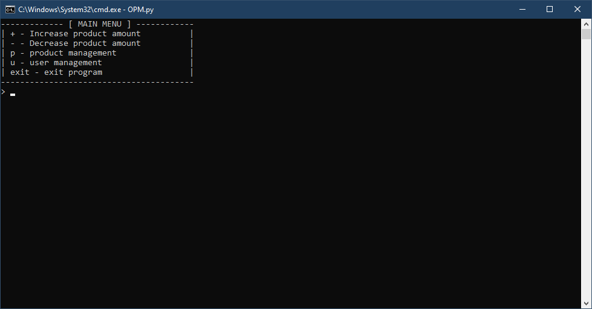
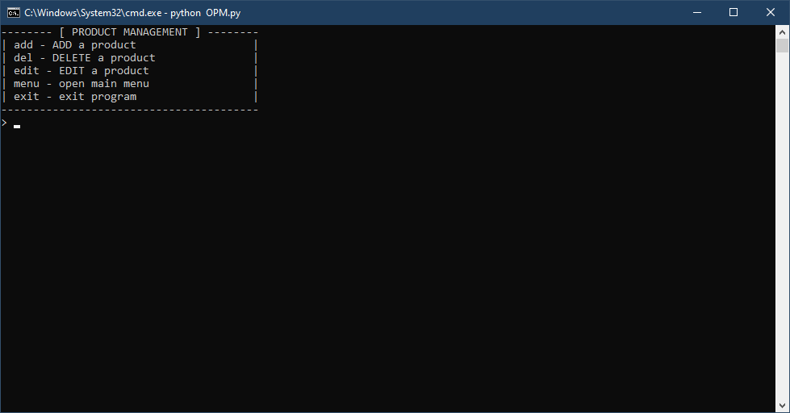
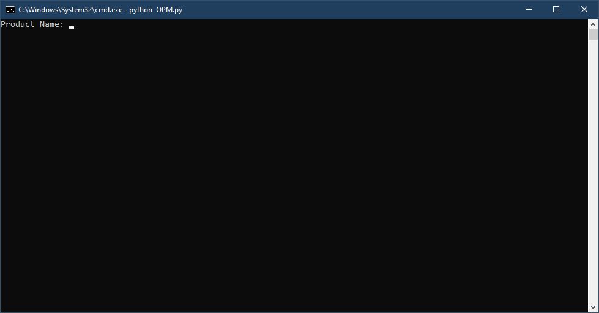
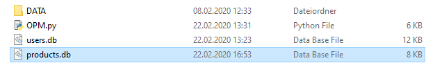
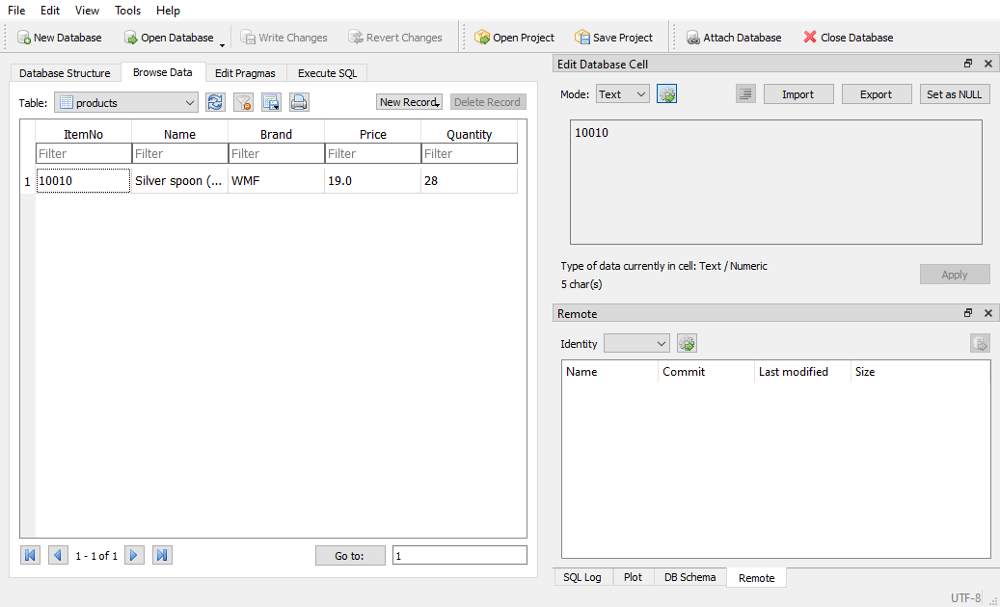
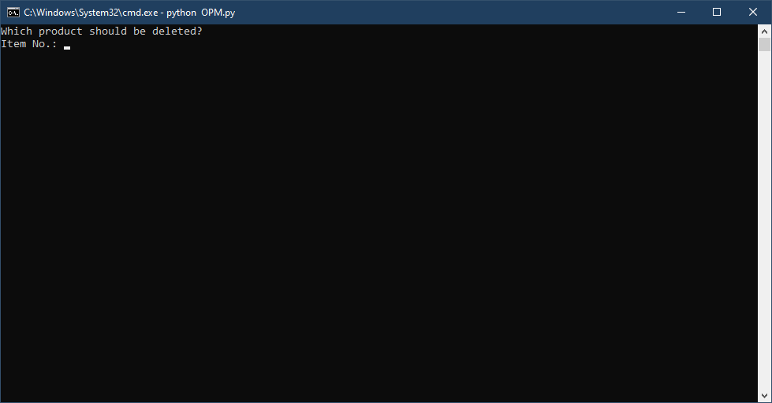
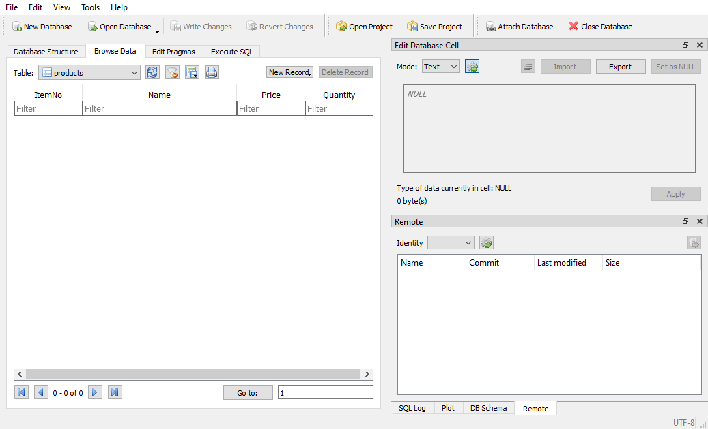

# Table of contents
1. First Steps
2. Product Management  
   2.1 Add a Product
   2.2 Delete a Product

# 1. First Steps
Open OPM.py to run Open Product Manager.  
After OPM has opened, a login prompt appears. *(Image 1)*  

  
*Image 1: Login prompt opens*  

The username must be entered here and can be confirmed with the Enter key.  
*By default the username is root*  
Now you are asked to enter a password.  
*By default the password is !root*

If the login was successful, you should now see the main menu. *(Image 2)*  

  
*Image 2: Main menu opens*  

# 2. Product Management

# 2.1 Add a Product
In this example there is a product with the following properties:
* Name:
  * Silver spoon (10pkg)
* Brand:
  * WMF
* Itemnumber:
  * 10010
* Price:
  * $ 19
* Available quantity:
  * 28  
  
First you must enter the product management.  
For this purpose the letter "p" (without quotation marks) must be entered in the main menu and confirmed with the Enter key.  
Now the product management menu should be open. *(Image 3)*  

  
*Image 3: Product management menu opens*  

to add a product, enter "add" (without quotation marks) and confirm with the Enter key.  
Now you are asked to enter the properties of the product.  

  
*Image 4: Enter product information*  

After you have entered and confirmed all information, the product and its properties are stored in a database.
The database can be found in the main folder under the name "products.db".

  
*Image 5: "products.db" location*  

If everything went well, the product should now be saved in the database.  
To test this you can check the file with DB Browser (https://sqlitebrowser.org/).  

  
*Image 6: View product from database*  

# 2.2 Delete a Product

First you must enter the product management.  
For this purpose the letter "p" (without quotation marks) must be entered in the main menu and confirmed with the Enter key.  
Now the product management menu should be open. *(Image 3)*  

  
*Image 3: Product management menu opens*  

To delete a product, enter "del" (without quotation marks) and confirm with the Enter key.  
Now you will be asked to enter the item number of the product you want to delete.  
Confirm your entry with the Enter key.  

  
*Image 7: Delete a product by item number* 

If everything went well, the product should now be deleted from the database.  
To test this you can check the "products.db" file with DB Browser (https://sqlitebrowser.org/).

  
*Image 8: Product is no longer in the database*  
